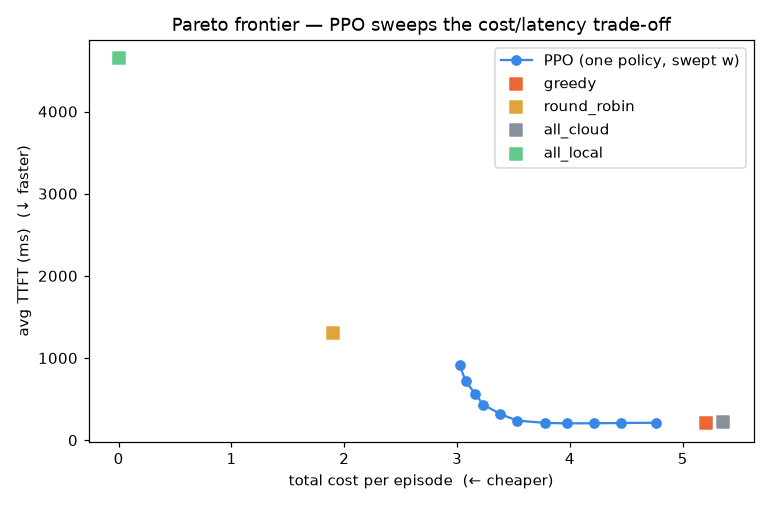
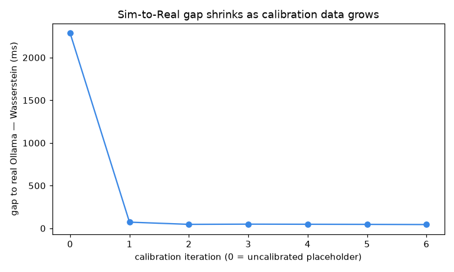
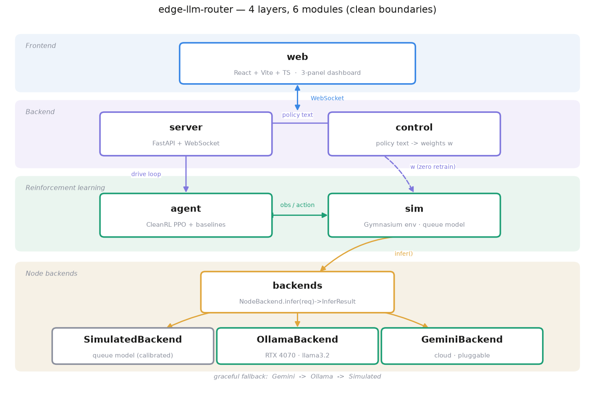

# edge-llm-router

> **RL 智慧 LLM 推論分流器** — 一個 PPO agent 逐請求決定把 LLM 推論送到 **本機 / 邊緣 / 雲** 哪裡跑，即時最佳化「首字延遲（TTFT）+ 成本」；使用者用**一句中文**改優化目標，行為**零重訓**當場切換。

LLM serving / inference-routing 方向的互動作品集。三面板即時儀表板：左＝即時分流、中＝AI vs 傳統賽跑、右＝中文方針框。

**🔗 線上 demo**：https://edge-llm-router-735815297154.asia-east1.run.app （GCP Cloud Run，閒置自動縮到零）

---

## 60 秒看懂

- **問題**：一堆使用者同時發 LLM 請求，每個該送去哪個節點？便宜的本機**一擠就爆**、雲端穩但**貴 100×**、邊緣居中。單看快或單看省都會偏；還要能隨當下負載動態權衡。
- **解法**：用 **PPO** 訓練一個逐請求分流的 policy，最佳化 TTFT + 成本；**權重條件化**讓「一句中文」即改目標、**零重訓**切換行為。
- **證據**：AI 跨**整條偏好光譜**打贏所有傳統策略；模擬被**真實硬體量測校準**（gap ↓98%）。

---

## 三大亮點（附硬證據）

### 1. 位置 / 層級路由（computation offloading）
三節點排隊模型：便宜節點忙就變慢、塞爆會丟棄。隨機亂丟 → **40% 丟棄、reward ≈ −700**；訓練後的 PPO → **0% 丟棄**，且在 w=0.5 用**低 29% 的成本**達到跟貪婪策略一樣的低延遲。

### 2. 目標條件化 RL：一句話改目標、零重訓
偏好權重 `w=(延遲, 成本)` 當成 observation 餵進去、訓練時隨機抽 w → 學成一整族 `π(a|s,w)`。demo 時中文經 LLM/規則轉成 w，**同一個網路即時換行為**：

| 中文方針 | 轉成 w | AI 分流變化 |
|---|---|---|
| 「成本太高，多用本機」 | (0.1, 0.9) | 猛用 local/edge，成本↓ |
| 「我要最快」 | (0.9, 0.1) | 改用 cloud |

### 3. Sim-to-Real 校準
邊緣節點用 **RTX 4070 真跑 Ollama（llama3.2）** 量真實 TTFT，回歸校準模擬參數；雲端可插拔真 Gemini。**gap 從 2286ms 收斂到 ~44ms（↓98%）**。

---

## 關鍵成果

**AI vs 基準線**（權重條件化 PPO，5 seed 平均，reward 越接近 0 越好）：

| w_cost | **PPO** | greedy（最佳基準） | 領先 |
|---|---|---|---|
| 0.1（要快） | **−93** | −102 | +8% |
| 0.5（平衡） | **−203** | −284 | +28% |
| 0.9（要省） | **−286** | −466 | **+39%** |

> 一個 policy 在每種偏好下都贏，而且**越在乎成本、贏越多**——傳統策略只能站在一個固定點。

**Pareto 前緣**：一個 policy 掃 w 描出整條「成本 vs TTFT」取捨曲線，全程 0% 丟棄，壓過傳統固定點。



**Sim-to-Real gap 隨校準下降**：拿真 Ollama 量測回歸校準，模擬對真實的差距收斂到幾十 ms。



---

## 系統架構



四層六模組，邊界乾淨：`sim` 不知後端真假、`server` 不碰 PPO 內部、`web` 只跟 `server` 講話。真實後端有**優雅降級**：Gemini 額度沒了 → 本機 Ollama → 模擬，永不中斷。完整逐塊說明與資料流見 **[docs/architecture.md](docs/architecture.md)**。

---

## 技術棧

Python 3.12 · PyTorch（CPU）· **CleanRL PPO**（單檔、權重條件化）· Gymnasium · NumPy/SciPy · Ollama（4070 邊緣）· Gemini 免費層（雲端 + 控制層）· FastAPI + WebSocket · React + Vite + TypeScript · MLflow · Docker · GitHub Actions · uv

**0 元鐵則**：全開源、不接付費 API；LLM 走本機 Ollama 或 Gemini 免費層。

---

## 快速開始

```bash
# 環境（用 uv，Python 3.12）
uv sync --dev
uv run python scripts/check_env.py     # 環境就緒檢查

# 訓練（CPU，約幾分鐘）：權重條件化 PPO，並和基準線比一次
uv run python scripts/train_wc.py

# 起服務（前端已 build 進 dist；開 http://localhost:8000）
uv run uvicorn edge_llm_router.server.app:app

# 或一鍵容器（無需 GPU / API key）
docker build -t edge-llm-router .
docker run --rm -p 8080:8000 edge-llm-router
```

前端開發熱重載：`npm --prefix web run dev`（5173，連後端 8000）。

---

## 結果重現

```bash
uv run python scripts/random_rollout.py        # 隨機基準線（要被打敗的地板）
uv run python eval/compare.py                  # AI vs 4 條基準線 → outputs/*.{json,html}
uv run python eval/pareto.py                   # Pareto 前緣圖
uv run python calibration/run_calibration.py   # 量真 Ollama → 校準 → gap 圖（需 Ollama）
```

---

## 專案結構與文件庫

```
src/edge_llm_router/  backends/ sim/ agent/ control/ server/  + config.py metrics.py evaluation.py calibration.py
web/                  React + Vite + TS 三面板
eval/ calibration/    分析腳本（→ outputs/）
docs/                 觀念檔 + 每階段里程碑筆記
tests/                66 個測試
```

邊做邊寫的里程碑筆記（做了什麼、為什麼、踩什麼坑）：
[m0 骨架](docs/m0-scaffold.md) · [m1 backends](docs/m1-backends.md) · [m2 sim](docs/m2-sim.md) · [m3 agent（AI 贏）](docs/m3-agent.md) · [m4 server+web](docs/m4-server-web.md) · [m5 control](docs/m5-control.md) · [m6 校準+部署](docs/m6-calibration-deploy.md) · [m7 進階圖表](docs/m7-advanced.md)
觀念白話：[concepts](docs/concepts.md) · [foundations](docs/foundations.md) · [tech-stack](docs/tech-stack.md)

---

## 品質

`uv run pytest -q`（**66 passed**）· `uv run ruff check`（clean）· GitHub Actions CI（ruff + pytest + 環境檢查）。
